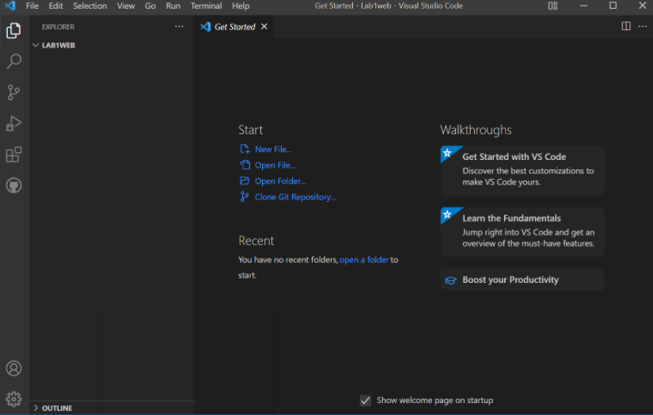
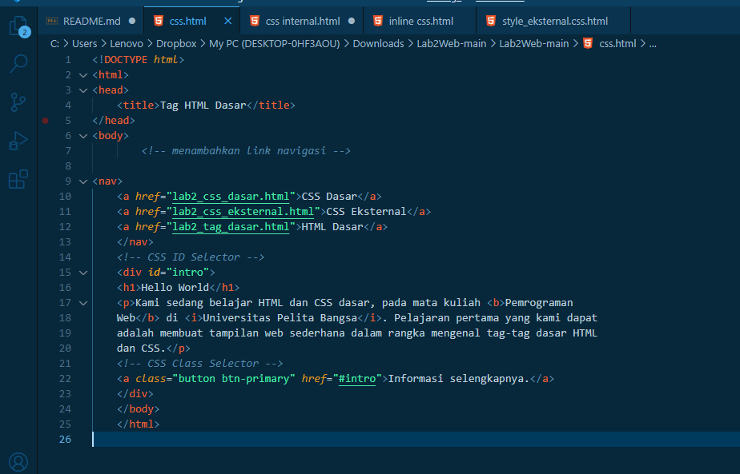
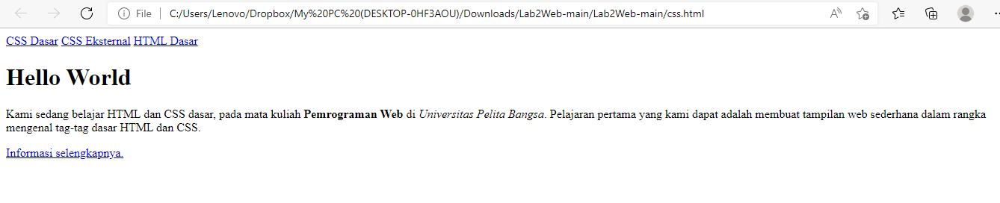
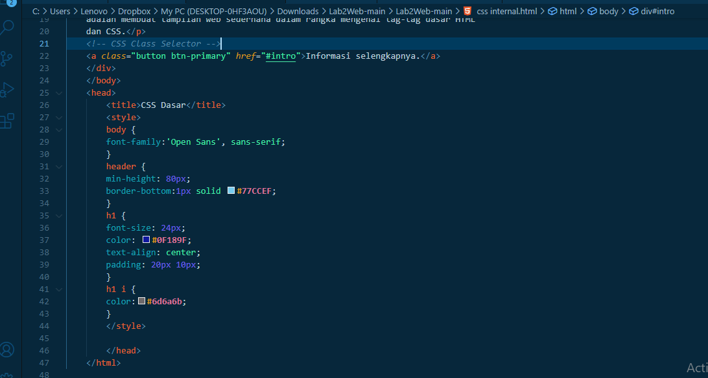

# Lab2Web

| Nama      | Rafi Ubaidillah  |
| ----------- | ----------- |
| NIM     | 312010090      |
| Kelas   | TI.20.A.1        |

## **Langkah-Langkah Praktikum**

Persiapan membuka VSCode dan Browser

# Modul Praktikum Pemrograman Web

# 1. Membuat dokumen HTML

Kemudian buat file baru dengan nama css.html dan tambahkan  dokumen HTML. 

Selanjutnya simpan dan buka pada brwoser untuk melihat hasilnya.

# 2. Mendeklarasikan CSS Internal

Kemudian tambahkan deklarasi CSS internal seperti berikut pada bagian head dokumen.

